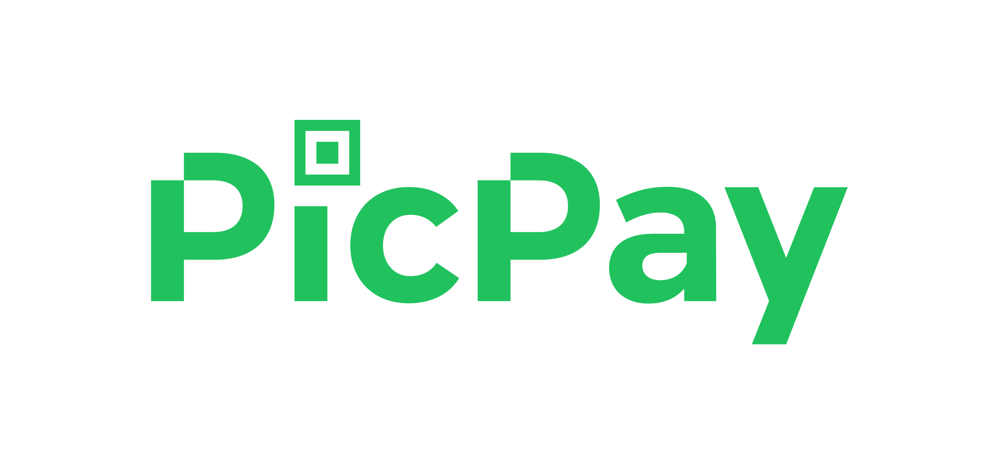

<h1 align="center">

</h1>

  

# Clone PicPay
## Descrição do Projeto

 Projeto clone da interface do PicPay desenvolvida com React Native e Expo.

### Status do Projeto
> Status do Projeto: Em desenvolvimento :warning:

### :rocket: Como instalar e executar:  
- `git clone https://github.com/brunoinx/clone-picpay.git`;
   
- **Go to repository folder**
- `cd clone-picpay`;
- `yarn or npm install` (install all dependencies);
- `yarn start, npm start or expo-start` (Run to Project);

### :heavy_check_mark: :iphone: Screens
<h1 align="center" margin-left=5px>
    
    
</h1>

### :mortar_board: Quem ministrou?
 - O projeto teve como base as aulas ministradas pelo **[Mateus Silva](https://github.com/maateusilva)** disponível nessa **[Playlist](https://www.youtube.com/playlist?list=PLPXWI3llyMiIfgu7p65MxdEKrplFbGbMg)** no Youtube;  

  

<h4 align="center">
    Made with 👨‍💻💚 by <a href="https://www.linkedin.com/in/bruno-henrique10/" target="_blank">Bruno Henrique</a>
</h4>
